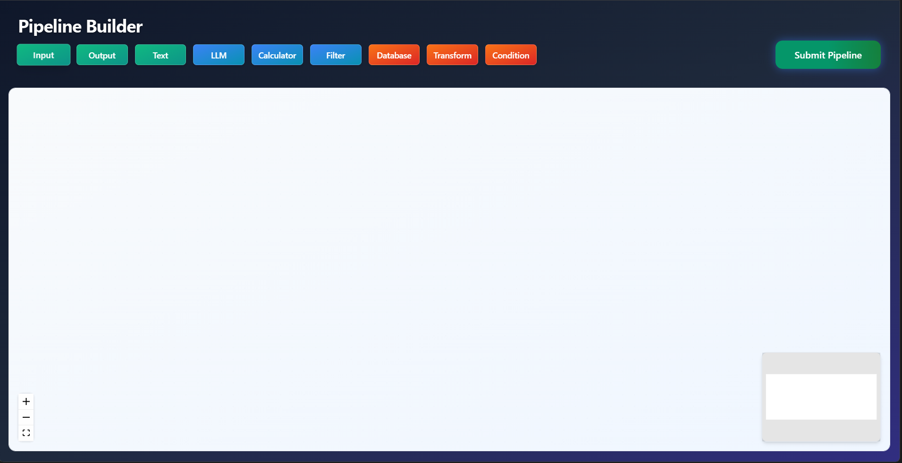
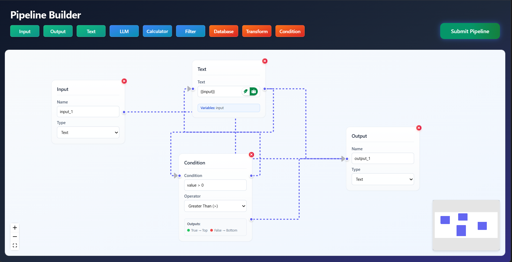
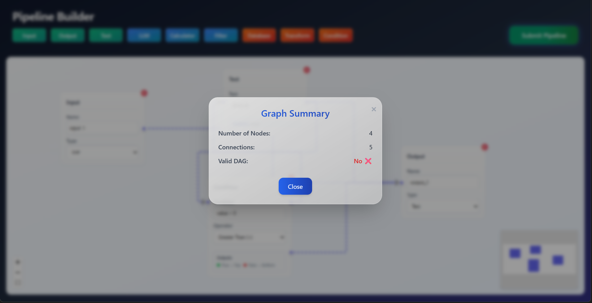
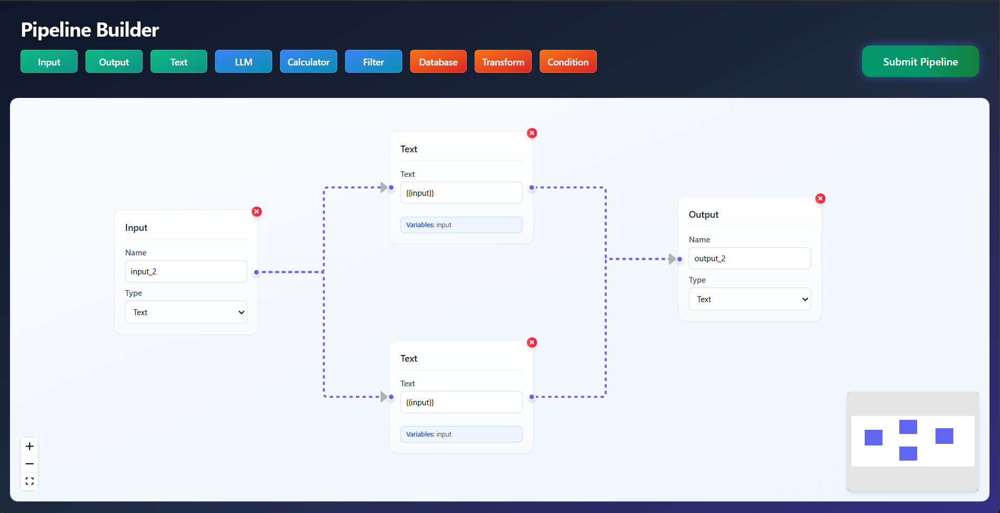
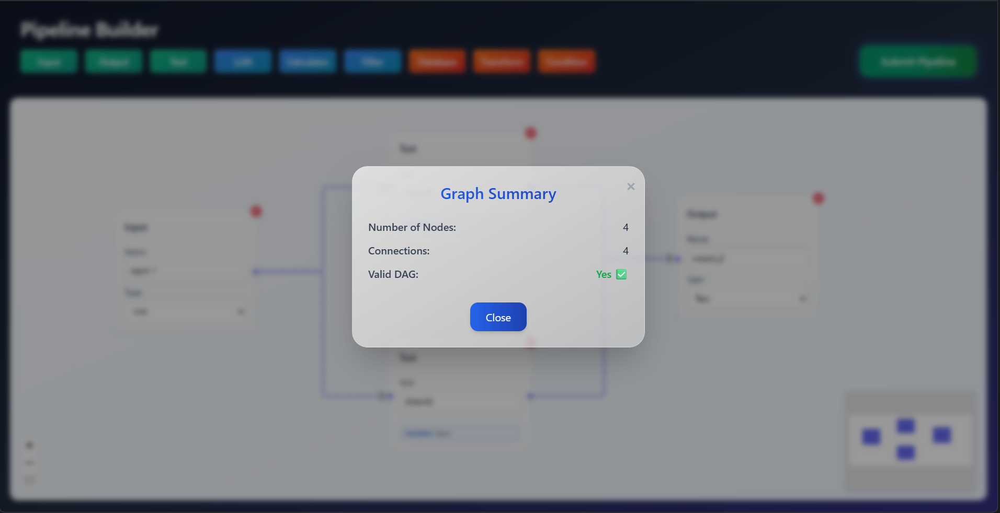

# ⚡️ Node-Based Pipeline Builder  
### 🧩 React Flow • 🌐 FastAPI • 🛠️ Custom Node Abstraction

A fully custom, modular, and scalable **node-based pipeline builder**, engineered as a personal project to explore visual pipelines, abstraction patterns, and backend graph validation.

This project demonstrates complete end-to-end architecture across **frontend**, **backend**, **UI/UX**, and **graph logic**

---
## 📷 Demo

Here’s what the pipeline builder app looks like:  







---

## 🛠️ Tech Stack

### **Frontend**
- ⚛️ **React.js**
- 🔁 **React Flow**
- 🟨 **JavaScript**
- 🧱 Custom **Node Abstraction System**
- 🎨 Tailwind / Chakra / Custom CSS

### **Backend**
- 🐍 **Python**
- 🚀 **FastAPI**
- 🔥 **Uvicorn**

---

## ✨ Core Features

### **1. 🧱 Node Abstraction Framework**
A clean, reusable **BaseNode** architecture enabling:

- Shared styling & structure  
- Configurable I/O handles  
- Extendable behaviors  
- Rapid creation of new nodes  

Using this system, I built **five additional custom nodes** to demonstrate the flexibility and scalability of the abstraction.

---

### **2. 🎨 Modern, Consistent Styling**
A complete UI overhaul to create a polished, unified design:

- Responsive layout  
- Smooth transitions & interactions  
- Clean card-based node design  
- Professional workflow-tool aesthetics  

---

### **3. 📝 Advanced Text Node**
The Text Node includes intelligent enhancements:

#### 📏 **Auto-Resizing**
Automatically adjusts node **width & height** based on user input for better readability.

#### 🧩 **Variable Extraction**
Supports variable syntax: {{ variableName }}

The system:

- Detects valid JS variable names  
- Dynamically generates **new handles**  
- Syncs handle positions and updates on change  

---

## 🔗 Frontend ↔ Backend Integration

A complete request-response loop is implemented.

### **Frontend (`submit.js`)**
- Collects nodes & edges  
- Sends data to `/pipelines/parse`  
- Receives pipeline metrics  
- Displays results in a user-friendly alert  

### **Backend (`main.py`)**
- Parses the pipeline  
- Counts nodes & edges  
- Validates **DAG (Directed Acyclic Graph)** structure  
- Returns:

```json
{
  "num_nodes": 0,
  "num_edges": 0,
  "is_dag": true
}
```


## 🚀 Getting Started

### **Frontend**
```bash
cd frontend
npm install
npm start
```

### **Backend**
```bash
cd backend
uvicorn main:app --reload
```

## 📁 Project Structure
```bash
/frontend
└── src
├── nodes/ # BaseNode + custom nodes
├── components/
└── submit.js # Backend integration

/backend
├── main.py # FastAPI app & DAG validation
└── utils/
```


